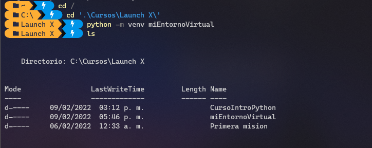
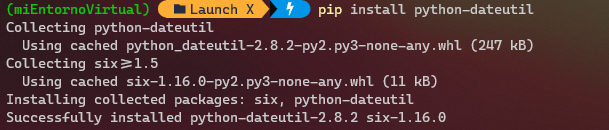
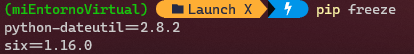

# Kata del módulo 2
## Crear un paquete
### Crear un entorno virtual
Crea un entorno virtual mediante ``venv``
* Ejecutar en la terminal: ``python -m venv nombreDelEntornoVirtual``



* Ejecutar el comando para activar el entorno virtual: ``source env/Scripts/activate``


### Instalar una biblioteca
* Ejecutar el comando ``pip freeze`` para ver las bibliotecas instaladas en el entorno:

Ninguna biblioteca instalada.


* Ejecutar el comando ``pip install`` para instalar una biblioteca:



* Volver a ejecutar ```pip freeze``` para ver cómo ha cambiado la lista de bibliotecas:



### Desactivar un entorno virtual
Ejecutar el comando ``deactivate``:


